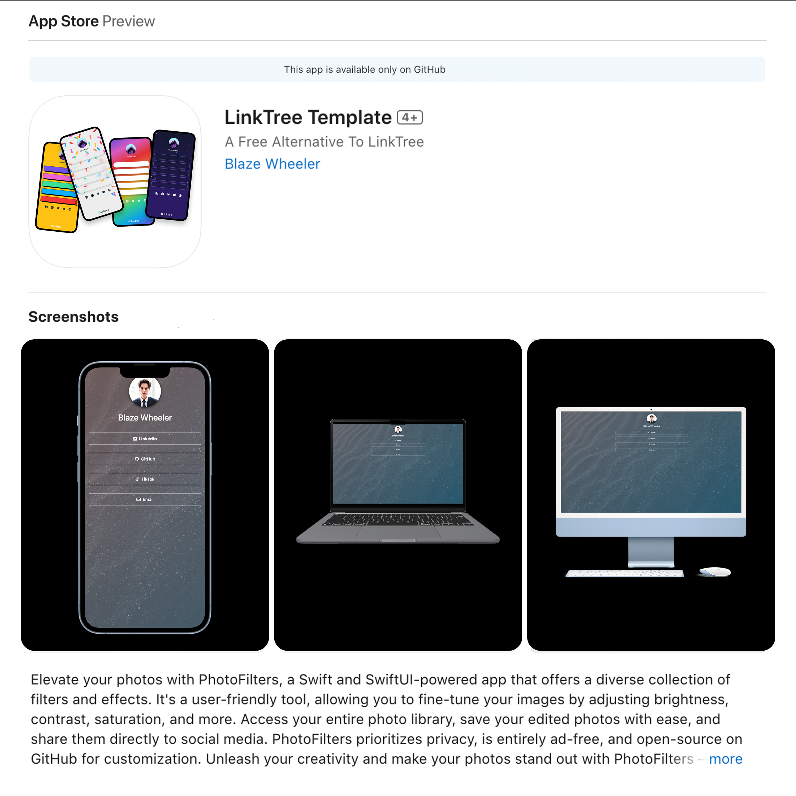

<a name="readme-top"></a>

<!-- PROJECT SHIELDS -->
[![Apple-Silicon-Shield]][Apple-Silicon-Shield-url]
[![MIT License][license-shield]][license-url]


[![LinkedIn][linkedin-shield]][linkedin-url]
[![GitHub][GitHub-shield]][GitHub-url]


<!-- PROJECT LOGO -->
<br />
<div align="center">
  <a href="">
    
  </a>

  <h3 align="center">Link Tree Template</h3>

  <p align="center">
    A Free LinkTree Alternative
    <br />
    </div>


<!-- ABOUT THE PROJECT -->
## About The Project


Discover a whole new way to curate and present your online presence with our LinkTree Template. This dynamic and fully customizable platform lets you stylishly showcase your social media profiles. You're no longer restricted to traditional, one-dimensional link trees. With our user-friendly interface and straightforward code, personalization is a breeze. Change backgrounds, fonts, icons, and colors to truly reflect your individuality. The mesmerizing color-changing background adds an element of enchantment, from soothing gradients to vibrant transitions. Easily connect your various social profiles and platforms, from Instagram and TikTok to Twitter and YouTube. With open-source flexibility, you can make it entirely your own. Your digital identity, your way. Start building your unique hub today.





<p align="right">(<a href="#readme-top">back to top</a>)</p>


### Built With

This Application is built HTML & CSS

* [![HTML-badge][HTML-badge]][HTML-url]
* [![CSS-badge][CSS-badge]][CSS-url]

<p align="right">(<a href="#readme-top">back to top</a>)</p>


<!-- GETTING STARTED -->
## Getting Started / Installation

Getting started is fairly simple...

### Prerequisites


* Download repository 

* Open
  ```sh
  index.html
  ```
* Build & Run


<!-- LICENSE -->


# Released Under MIT License

Copyright (c) 2022 Blaze Wheeler,

Permission is hereby granted, free of charge, to any person
obtaining a copy of this software and associated documentation
files (the "Software"), to deal in the Software without
restriction, including without limitation the rights to use,
copy, modify, merge, publish, distribute, sublicense, and/or sell
copies of the Software, and to permit persons to whom the
Software is furnished to do so, subject to the following
conditions:

The above copyright notice and this permission notice shall be
included in all copies or substantial portions of the Software.

THE SOFTWARE IS PROVIDED "AS IS", WITHOUT WARRANTY OF ANY KIND,
EXPRESS OR IMPLIED, INCLUDING BUT NOT LIMITED TO THE WARRANTIES
OF MERCHANTABILITY, FITNESS FOR A PARTICULAR PURPOSE AND
NONINFRINGEMENT. IN NO EVENT SHALL THE AUTHORS OR COPYRIGHT
HOLDERS BE LIABLE FOR ANY CLAIM, DAMAGES OR OTHER LIABILITY,
WHETHER IN AN ACTION OF CONTRACT, TORT OR OTHERWISE, ARISING
FROM, OUT OF OR IN CONNECTION WITH THE SOFTWARE OR THE USE OR
OTHER DEALINGS IN THE SOFTWARE.
<p align="right">(<a href="#readme-top">back to top</a>)</p>


<!-- CONTACT -->
## Contact

Blaze Wheeler - [@blazew](https://www.instagram.com/blazew/) - wheelerb2@duq.edu


<p align="right">(<a href="#readme-top">back to top</a>)</p>


<!-- MARKDOWN LINKS & IMAGES -->


[Apple-Silicon-Shield]: https://img.shields.io/badge/Apple-Silicon_M2-999999?style=for-the-badge&logo=apple&logoColor=white
[Apple-Silicon-Shield-url]: https://support.apple.com/en-us/HT211814

[license-shield]: https://img.shields.io/github/license/othneildrew/Best-README-Template.svg?style=for-the-badge
[license-url]: https://www.mit.edu/~amini/LICENSE.md
[linkedin-shield]: https://img.shields.io/badge/-LinkedIn-black.svg?style=for-the-badge&logo=linkedin&colorB=555

[linkedin-url]:https://www.linkedin.com/in/blaze-wheeler-8306a2223/
[GitHub-shield]: 	https://img.shields.io/badge/GitHub-100000?style=for-the-badge&logo=github&logoColor=white
[GitHub-url]: https://github.com/blazeWheeler
[product-screenshot]: images/screenshot.png

[HTML-url]: https://www.w3schools.com/howto/howto_make_a_website.asp
[HTML-badge]: https://img.shields.io/badge/HTML5-E34F26.svg?style=for-the-badge&logo=HTML5&logoColor=white
[CSS-url]: https://www.w3schools.com/css/
[CSS-badge]: https://img.shields.io/badge/CSS3-1572B6.svg?style=for-the-badge&logo=CSS3&logoColor=white

